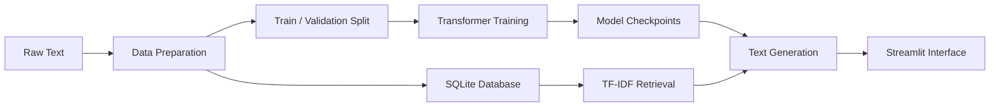

<div align="center">

# 🧠 Alice LLM Lab  
*A Character-Level Transformer with Retrieval-Augmented Generation*


A learning-focused project that builds a transformer language model from scratch,
trained on *Alice’s Adventures in Wonderland*, with retrieval-augmented generation
to keep outputs grounded in the source text.

</div>

---

## 🎯 Overview

This project demonstrates an end-to-end language modeling pipeline, starting from raw text preprocessing and extending through model training, text generation, and interactive inference.

The transformer is implemented directly in PyTorch and trained at the character level to keep all internal mechanics transparent. To improve contextual grounding during generation, relevant passages are retrieved from a local SQLite database using TF-IDF similarity and incorporated into the prompt when needed.

Everything runs locally, with an emphasis on understanding how each component fits together rather than optimizing for production scale.

---

## 🧠 How it works

The system follows a clear and traceable flow:

1. Raw text is cleaned and normalized  
2. Cleaned text is split into training and validation sets  
3. Text chunks are stored in a local SQLite database  
4. A character-level transformer is trained using PyTorch  
5. Relevant chunks are retrieved using TF-IDF similarity  
6. Retrieved context can be combined with prompts during generation  
7. A Streamlit interface provides interactive access to the model  

---

## 🏗️ Architecture



---

## 🔗 How the programs connect

Dataset preparation handles text cleaning, chunking, and database creation.  
The training module consumes the prepared data and produces model checkpoints and loss visualizations.

During inference, generation can either rely solely on the trained model or first retrieve relevant context from SQLite before generating text.  
The Streamlit app acts as a thin orchestration layer, exposing these capabilities through a simple user interface.

---

## 📤 Outputs you will see

Running the project produces:

• Processed training and validation text files  
• Chunked text stored in SQLite  
• Saved model checkpoints  
• Training loss plots  
• Generated text samples from CLI and UI  

---

## 📁 Project structure

```
alice-mini-llm/
├── app/                         # Streamlit user interface
│   └── streamlit_app.py
│
├── data/                        # Dataset storage
│   ├── raw/                     # Original text
│   │   └── alice.txt
│   ├── processed/               # Cleaned data and splits
│   │   ├── alice_clean.txt
│   │   ├── train.txt
│   │   ├── val.txt
│   │   └── chunks.jsonl
│   └── texts.db                 # SQLite retrieval database
│
├── outputs/                     # Generated artifacts
│   ├── checkpoints/             # Model checkpoints
│   └── plots/                   # Training loss visualization
│
├── src/                         # Core implementation
│   ├── data_prep/               # Dataset preparation logic
│   ├── model/                   # Transformer, training, generation
│   ├── rag/                     # Retrieval logic
│   ├── eval/                    # Evaluation utilities
│   ├── config.py                # Central configuration
│   └── inference.py             # Shared inference helpers
│
├── Execution_Guide.md
├── Project_Report.md
├── requirements.txt
└── pyproject.toml
```

---

## ⚙️ Setup and run

```bash
python -m venv .venv
source .venv/bin/activate   # Windows: .venv\Scripts\Activate.ps1
pip install -r requirements.txt
```

Prepare data:
```bash
python src/data_prep/dataset_builder.py
```

Train model:
```bash
python src/model/train.py
```

Generate text:
```bash
python src/model/generate.py --prompt "Alice was beginning to"
```

Run the UI:
```bash
streamlit run app/streamlit_app.py
```

---

## 🎥 Demo

https://github.com/user-attachments/assets/408ab851-1a6c-4491-b7a6-8aa4e77f990b

---

## ⚠️ Notes and limitations

• Learning-focused prototype  
• Small model trained on limited data  
• TF-IDF retrieval quality depends on chunking  
• Performance depends on local hardware  

---

## 👤 Author

**Abinash Prasana Selvanathan**

⭐ If you found this project useful, feel free to star the repository.
