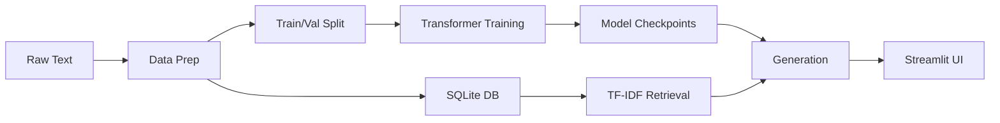

# 🧠 Alice LLM Lab  
*A Character-Level Transformer with Retrieval-Augmented Generation*

<div align="center">


A learning project that builds a transformer language model from scratch, trained on *Alice's Adventures in Wonderland* with retrieval-augmented generation capabilities.

[Quick Start](#-quick-start) • [Features](#-features) • [Architecture](#-architecture) • [Usage](#-usage)

</div>

---

## 🎯 Overview

This project implements a complete end-to-end language model pipeline—from raw text preprocessing to an interactive generation interface. Built entirely from scratch using PyTorch, it demonstrates core concepts in modern NLP without relying on pre-trained models or external APIs.

**What makes this different:**
- Transformer built from first principles (self-attention, positional encoding, layer norm)
- Character-level tokenization for maximum transparency
- Integrated RAG system using TF-IDF retrieval from SQLite
- Full training observability with checkpoints and loss visualization
- Everything runs locally

---

## ✨ Features

- **🔧 Custom Transformer** — Multi-head self-attention architecture built with PyTorch
- **📊 Training Pipeline** — Proper train/val splits, checkpointing, and loss tracking
- **🔍 RAG System** — TF-IDF-based retrieval from SQLite database for grounded generation
- **🎨 Interactive UI** — Streamlit interface for experimentation
- **📈 Visualization** — Training loss plots and generation monitoring
- **⚡ Fast Setup** — Single command installation and training

---

## 🏗️ Architecture



**Pipeline Flow:**
1. Text preprocessing and cleaning
2. Character-level tokenization and dataset creation
3. Chunk storage in SQLite with TF-IDF indexing
4. Transformer training with validation monitoring
5. Optional context retrieval for generation
6. Interactive inference through Streamlit

---

## 📁 Project Structure

```
alice-mini-llm/
├── app/
│   └── streamlit_app.py         # Interactive web interface
├── data/
│   ├── raw/alice.txt            # Source corpus
│   ├── processed/               # Cleaned data & splits
│   └── texts.db                 # Retrieval database
├── outputs/
│   ├── checkpoints/             # Model weights
│   └── plots/                   # Training visualizations
├── src/
│   ├── data_prep/               # Preprocessing pipeline
│   ├── model/                   # Transformer & training
│   ├── rag/                     # Retrieval system
│   └── config.py                # Configuration
└── requirements.txt
```

---

## 🚀 Quick Start

### Installation

```bash
# Clone the repository
git clone https://github.com/yourusername/alice-mini-llm.git
cd alice-mini-llm

# Create virtual environment
python -m venv .venv
source .venv/bin/activate  # On Windows: .venv\Scripts\Activate.ps1

# Install dependencies
pip install -r requirements.txt
```

### Usage

**1. Prepare Dataset**
```bash
python src/data_prep/dataset_builder.py
```

**2. Train Model**
```bash
python src/model/train.py
```
*Training takes 10-30 minutes depending on hardware*

**3. Generate Text**
```bash
python src/model/generate.py --prompt "Alice was beginning to" --temperature 0.8
```

**4. Launch UI**
```bash
streamlit run app/streamlit_app.py
```

---

## 💡 Usage Examples

### Standard Generation
```bash
python src/model/generate.py \
  --prompt "The Cheshire Cat" \
  --max_length 200 \
  --temperature 0.7
```

### RAG-Enhanced Generation
```bash
python src/model/generate.py \
  --prompt "What did the Caterpillar say?" \
  --use_rag \
  --max_length 150
```

### Custom Configuration
Edit `src/config.py` to modify:
- Model architecture (layers, heads, dimensions)
- Training hyperparameters (learning rate, batch size)
- Generation settings (temperature, sampling strategy)

---

## 📊 Understanding Results

**Training Loss** — Monitor `outputs/plots/loss.png`:
- Decreasing loss indicates learning
- Train/val gap shows generalization
- Plateau means convergence

**Generation Quality** — Character-level models produce creative but sometimes incoherent text. This is expected for small models on limited data.

**RAG Impact** — Compare outputs with/without `--use_rag` to see how retrieval grounds generation in source material.

---

## 🛠️ Technical Stack

| Component | Technology |
|-----------|-----------|
| Framework | PyTorch 2.0 |
| Interface | Streamlit |
| Database | SQLite3 |
| Retrieval | scikit-learn (TF-IDF) |
| Visualization | matplotlib |

---

## ⚠️ Limitations

- Small model trained on single book (limited generalization)
- Character-level tokenization (slower than subword methods)
- TF-IDF retrieval (simpler than dense embeddings)
- No GPU acceleration required but training is CPU-bound

These are intentional tradeoffs for educational clarity.

---

## 🎓 Learning Outcomes

By exploring this project, you'll understand:
- Transformer architecture internals
- Training loop implementation
- Text generation strategies
- RAG system design
- End-to-end ML pipelines

---

## 🔮 Future Improvements

- [ ] Beam search decoding
- [ ] Subword tokenization (BPE)
- [ ] Dense retrieval with embeddings
- [ ] Evaluation metrics (perplexity, BLEU)
- [ ] Multi-GPU training support
- [ ] API endpoint for generation

---

## 📄 License

MIT License - feel free to use for learning and experimentation.

---

## 👤 Author

**Abinash Prasana Selvanathan**

[](https://github.com/yourusername)
[](https://linkedin.com/in/yourprofile)

---

<div align="center">

**⭐ Star this repo if you found it helpful!**

Built with 💙 as a deep dive into transformer architectures and RAG systems

</div>